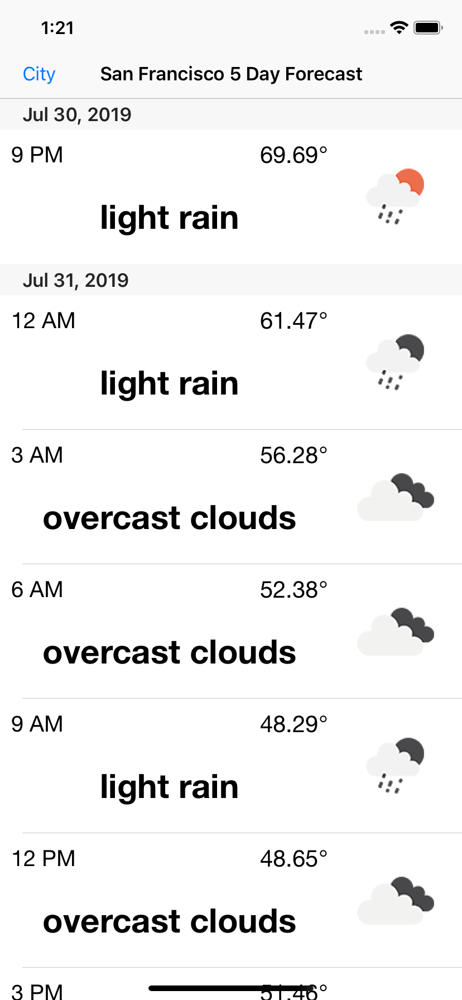

# iOSWeatherApp

This is an iOS app that gives you a five day weather forecast using Open Weather Map and Google Location Auto Complete. Weather for every three hours.

Each day has their own section and each row contains weather for that hour:
 

Change the city using Google Location Auto Complete:
 

Get more info about the weather at that time:
 

